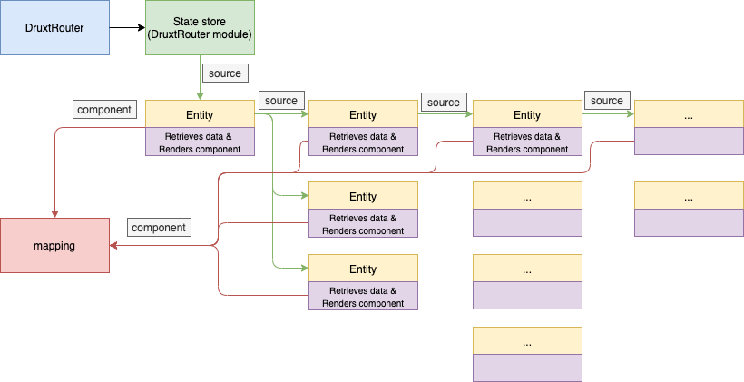

# Entity
The `Entity` component together with the accompanying `EntityMixin` acts as the entry point for your data. It will automate the process of retrieving the data and rendering the correct component from the [mapping].

**!important!** The `Entity` uses the [ResourceMixin] and therefor requires a `source` to be a [Resource] passed along as a prop. 
This `source` can be passed down to the component as a prop or provided by the [DruxtRouter]. If the data is empty inside the resource the [ResourceMixin] will activate to retrieve the data first. It then passes along the filled resource as a prop to the **mapped component**.

The `EntityMixin` handles the passed along prop `resource` in the **mapped component** thereby giving it access to the loaded resource from Drupal.

## Recursive automation
When automating all content from Drupal resources the mixin enters a recursive loop because all components rendered by the `Entity` can have the `Entity` implemented as well. 

The 'top' `source` is provided by the [DruxtRouter] through the [DrupalMiddleware] and passed along from the state store. 

After this each component rendered now has it's own mixin to recursively continue like so:



## Fallback
When no matching component is found in the [mapping], a Fallback component is rendered instead. This component is renderless so it returns no errors but can be viewed in the [Vue chrome extension]:

## Usage tip
A good tip is to create a shorthand version using the DrupalMixin to ensure the DrupalMixin always has the [mapping] present:

```javascript
// This component can now be used throughout the Nuxt application
import { Entity } from '@hyral/nuxt-drupal';
import mapping from '@/modules/drupal/mapping';

export default Entity('drupal', mapping);
```

```vue
<template>
  <div>
    <!-- An entity from a new resource -->
    <Entity :source="new Resource(id, type)" />
    <!-- An entity from the existing resources-->
    <Entity :source="resource.data.image" />
  </div>
</template>

<script>
import Entity from './entity';
import { EntityMixin } from '@hyral/nuxt-drupal';

export default {
  mixins: [EntityMixin],
  components: { Entity },
};
</script>
```

[mapping]: mapping.md
[ResourceMixin]: mixin.md
[DruxtRouter]: druxt.md
[DrupalMiddleware]: middleware.md
[Resource]: https://github.com/SyneticNL/Hyral/blob/v2.0.0-prerelease/packages/core/documentation/Core/resource.md
[Vue chrome extension]: https://chrome.google.com/webstore/detail/vuejs-devtools/nhdogjmejiglipccpnnnanhbledajbpd
