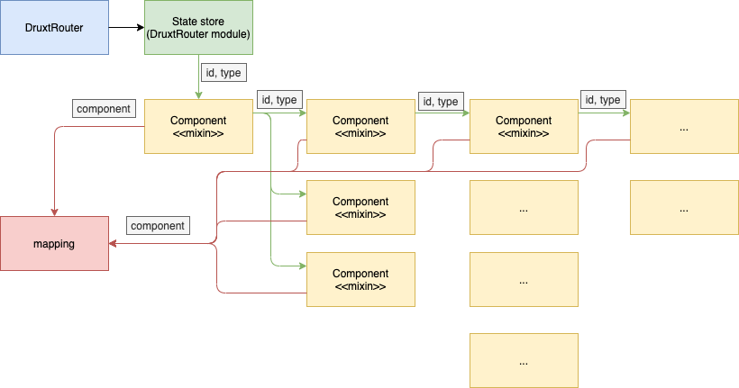

# DrupalMixin
The DrupalMixin is a controller-like mixin that uses the [ResourceMixin] from `@hyral/vue` to automate the retrieval of resources and the [mapping] to each component. 

<!-- TODO: Alter this after removing Druxt dependency -->
**!important!** The `DrupalMixin` uses the [ResourceMixin] and therefor requires an `id` and `resourceType` to be present in the component to work properly. 
This `id` and `resourceType` can be passed down to the component using the mixin as a prop or provided by the [DruxtRouter].

## Recursive automation
When automating all content from Drupal resources the mixin enters a recursive loop because all components rendered by the `DrupalMixin` using the `<component/>` tag can have the `DrupalMixin` implemented as well. 

The 'top' `id` and `resourceType` is provided by the [DruxtRouter] through the [DrupalMiddleware] and passed along from the state store. 

After this each component rendered now has it's own mixin to recursively continue like so:



## Fallback
When no matching component is found in the [mapping], a Fallback component is rendered instead. This component is renderless so it returns no errors but can be viewed in the [Vue chrome extension]:

```typescript
export default {
  render(): unknown {
    return {};
  },
};
```

## Usage
### Tip:
A good tip is to create a shorthand version using the DrupalMixin to ensure the DrupalMixin always has the [mapping] present:

```javascript
// This mixin can now be used throughout the Nuxt application
import { DrupalMixin } from '@hyral/nuxt-drupal';
import mapping from './mapping';

export default {
  mixins: [DrupalMixin],
  computed: {
    mapping: () => (mapping.entities),
  },
};
```

[ResourceMixin]: ../../../packages/vue/documentation/Vue.md
[DruxtRouter]: druxt.md
[DrupalMiddleware]: middleware.md
[mapping]: mapping.md
[Vue chrome extension]: https://chrome.google.com/webstore/detail/vuejs-devtools/nhdogjmejiglipccpnnnanhbledajbpd